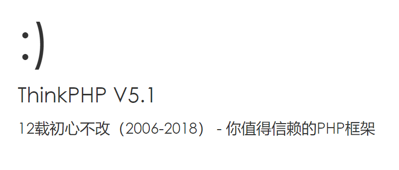

# 介绍

think-swoole是think framework的扩展包，主要解决thinkphp在通讯方面的欠缺，方便快速搭建TCP,UDP，Websocket服务等。  
由于thinkphp并非专门为常住内存模式开发的框架，因而在使用过程当中需要注意一些问题。

## 快速搭建

搭建tp5.1环境
```
composer create-project topthink/think tp
```
安装tp-swoole扩展包
```
cd tp
composer require topthink/think-swoole
```

启动服务

```
php think swoole
```
打开[http://127.0.0.1:9501](http://127.0.0.1:9501) ，即可看到启动页面,服务启动成功

