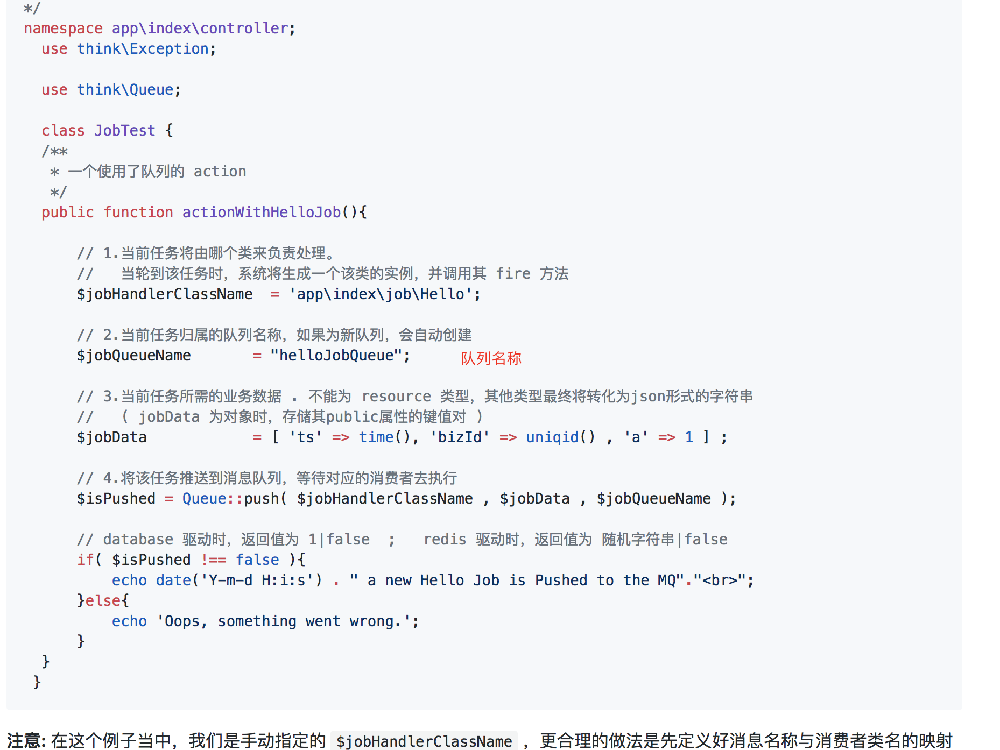

# 队列
tp-swoole提供基于tp-queue的队列服务，方便处理耗时的服务。
队列配置信息在swoole.php文件当中,支持两种运行方式，task和process方式，task方式需要配置task_worker_num，该方式适用于任务不太耗时，由于所有task进程共享，所以消耗资源相对较少，但是当执行非常耗时任务后可以造成主系统卡顿。如遇任务非常耗时，推荐采用process方式，该模式是独立进程，且当进程因异常退出后会自动启动。
```php
'queue_type'=>'task',//task or process
    'queue'=>[
        "Index"=>[
                      "delay"=>0,//延迟时间
                      "sleep"=>3,//休息时间
                      "maxTries"=>0,//重试次数
                      "nums"=>2//进程数量
        ],
    ]
```

上述配置中Index是队列名称，下图中加入配置文件的话应该为
```php
'queue_type'=>'task',//task or process
    'queue'=>[
        "helloJobQueue"=>[
                      "delay"=>0,//延迟时间
                      "sleep"=>3,//休息时间
                      "maxTries"=>0,//重试次数
                      "nums"=>2//进程数量
        ],
    ]
```



其中队列使用文档推荐查看[https://github.com/coolseven/notes/blob/master/thinkphp-queue/README.md](https://github.com/coolseven/notes/blob/master/thinkphp-queue/README.md)